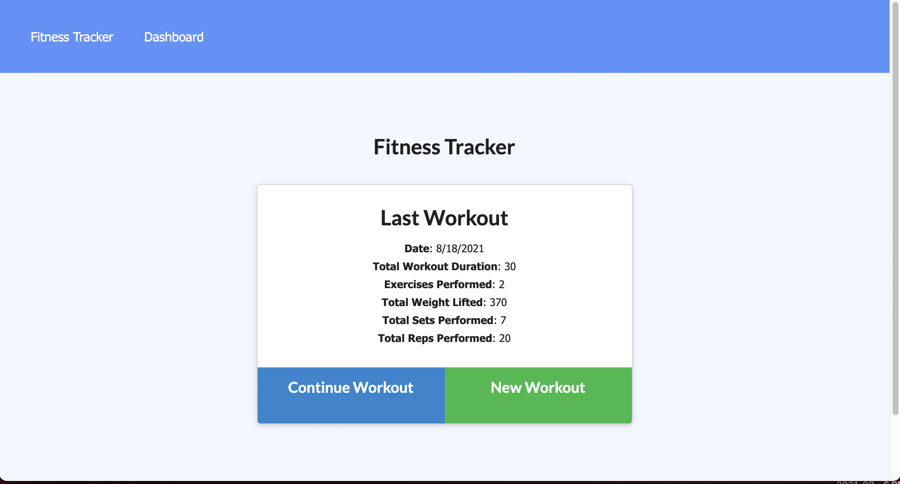
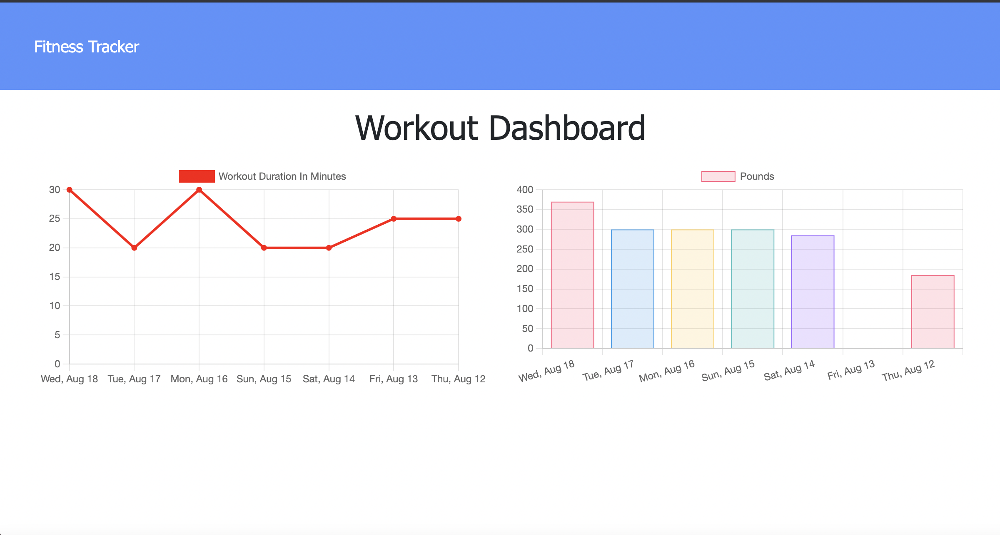

# Fitness-Tracker

## Description

The goal for this project was to create the backend of an application that uses mongoDB and mongoose. The application logs
fitness activities including various workouts such as resistance or cardio based ones. Given different inputs, it tracks how
long your exercise period was as well as how much weight you lifted over the course of a week. 

## Installation

This application is deployed on heroku at: https://ls-workout-tracker.herokuapp.com/
It can also be cloned and ran on your machine, it requires mongoDB, and node.js. First run npm i, then npm run seed to generate
some example data. Next you can run npm start in your terminal and the app will run on your local host on port 3000. 

## Usage

Here are some screenshots of what the deployed application looks like:

